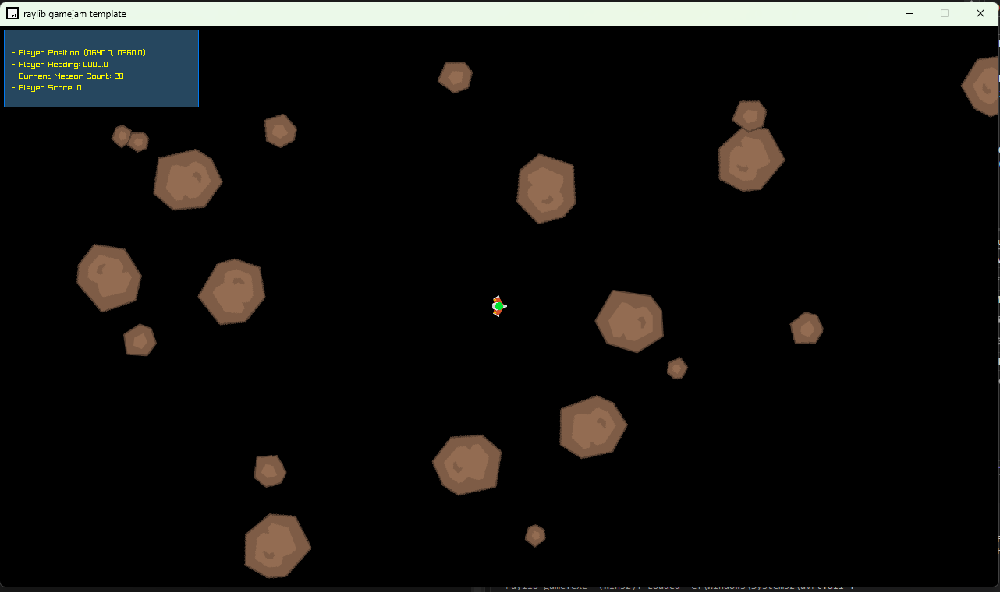

-----------------------------------

## Asteroids Tutorial with Raylib

Available for play on Itch.io - https://eyuzwa.itch.io/asteroids-tutorial-with-raylib

### Description

Move your player with the arrow keys, and use the left-control key to fire your laser. When
all of the asteroids have been destroyed, the Earth is saved and the game is over.

### Features

 - Player Input Guidance System
 - Player Shooting Power
 - Meteors traveling through space

### Controls

Keyboard:
 - Left Arrow Key: Rotate your ship left
 - Right Arrow Key: Rotate your ship right
 - Up Arrow Key: Increase your ship thrust
 - Left Control Key: Fire a laser blast

### Screenshots

### Developers

 - Erik Yuzwa - Lead Developer, Product Owner

### Links

 - YouTube Gameplay: $(YouTube Link)
 - itch.io Release: $(itch.io Game Page)

### License

This game sources are licensed under an unmodified zlib/libpng license, which is an OSI-certified, BSD-like license that allows static linking with closed source software. Check [LICENSE](LICENSE) for further details.

*Copyright (c) 2023 erikyuzwa (@erikyuzwa)*
